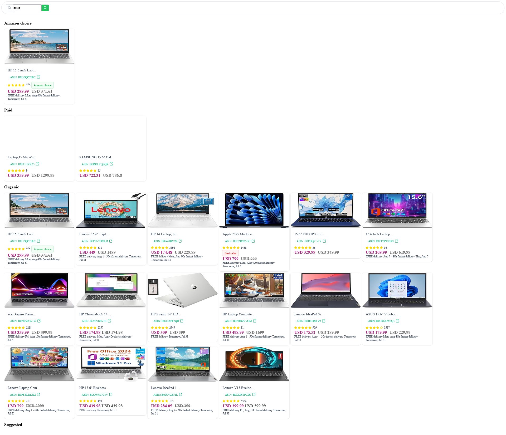
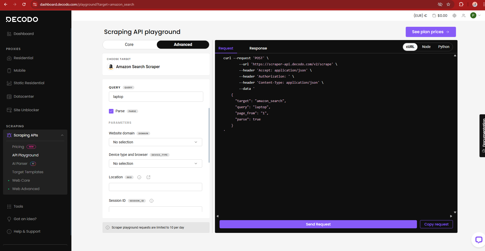

# 🛒 Amazon Product Scraper - Angular Frontend

This is a simple web application built with **Angular 19** that displays a list of Amazon products obtained through web scraping. The scraping is handled via **Smartproxy** to bypass restrictions and collect product data from Amazon. The frontend consumes this data and displays it using **PrimeNG** components.

---

## 🧰 Technologies Used

- Angular 19  
- PrimeNG (UI components library)  
- TypeScript  
- RxJS  
- Smartproxy (used on backend for scraping)  
- REST API (to fetch product data)

---

## 🚀 Features

- Fetches a list of Amazon products (e.g., title, price, image, rating, etc.)
- Clean and responsive UI built with PrimeNG

---

## 🖼️ Screenshots

### 📦 Product List

### 🧾 Product Detail (Decodo View)

